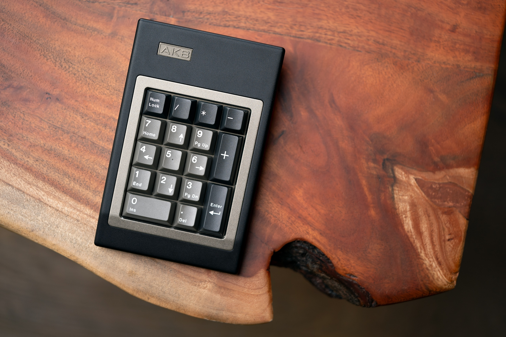
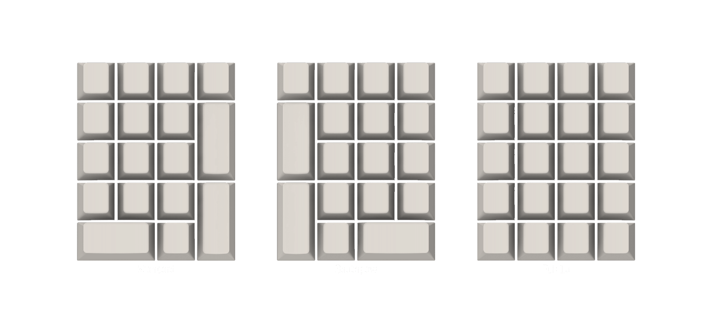

# AKB OGRN

The OGR was designed as a perfect companion to the [OGR](../ogr). 

* [Website](https://alchemistkeyboards.com/projects/keyboards/ogr/)
* [Geekhack](https://geekhack.org/index.php?topic=117142.0)

## Specifications

* Inspired by [Cherry G81-3077/G80-0832](https://deskthority.net/wiki/Cherry_G81-3077)
* 10° typing angle
* Full 6063 aluminium construction
* Bead-blasted and anodised finish
* Top mounted carbon fibre plate
* 21.5mm effective [front height](./images/dimensions.png) (with bumpons)
* QMK and VIA-compatible USB-C PCBs
* Integrated cable aesthetic
* Period-authentic product [stickers](./images/stickers.jpg)

## Layout support

## Kit contents

* 1v Top Case – 6063 Aluminium
* 1× Bottom Case – 6063 Aluminium
* 1× Accent – 6063 Aluminium
* 1× Plate – Carbon fiber
* 1× Badge – 6063 Aluminium
* 1× Solder PCB – Black FR4 with green solder mask
* 1× EVA plate foam
* 4× [AKB Bumpons](https://github.com/akb-repos/feet) – Injection molded silicone
* 1× Bottom sticker
* 1× Split cable grommet
* 4× Torx button screw M3 x 6mm in A2 stainless steel (plate)
* 4× Torx button screw M3 x 6mm in A2 stainless steel (accent)
* 4× Torx button screw M3 x 12mm in A2 stainless steel (case)
* 2× Torx countersunk screw M3 x 5mm in A2 stainless steel (badge)
* 1× Carry Case
